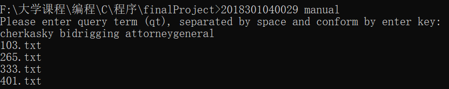
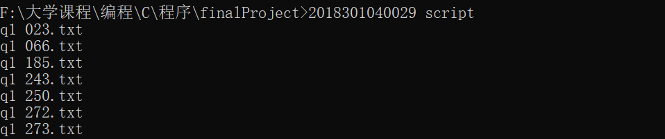
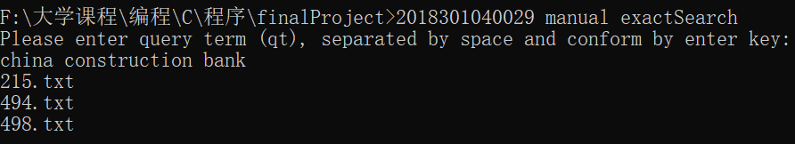
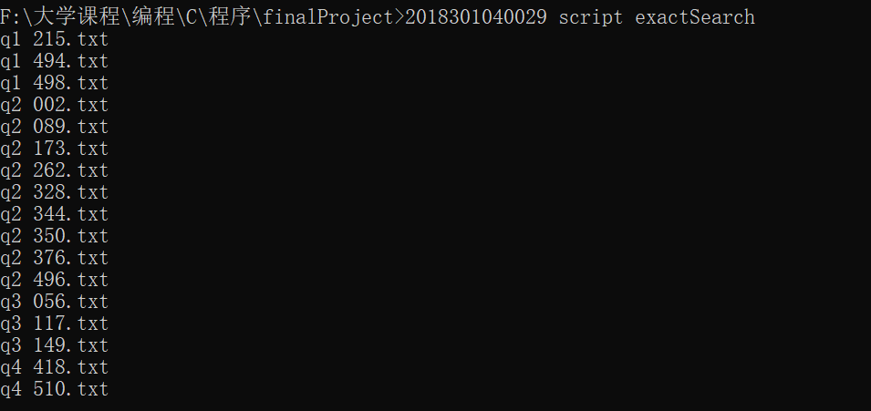
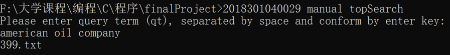
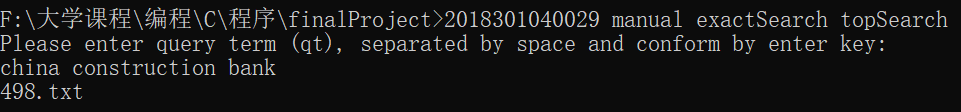
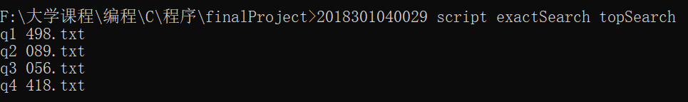
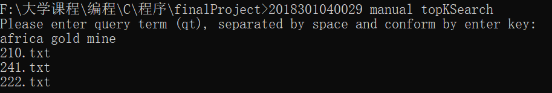
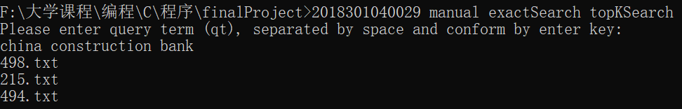
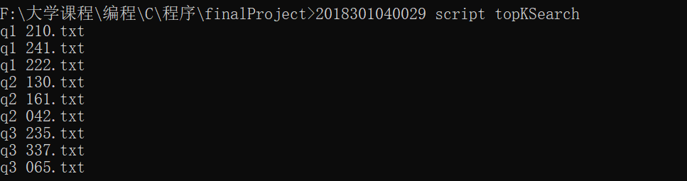

(pic 0)
The search engine can quickly traverse a large number of documents, and quickly return documents that meet the conditions according to query terms and search patterns, and support sorting documents based on total number/number of keywords.

## query terms input mode
+ manual  
  
+ script  
  realize bulk search  
  (pic 2)  
  
  
## search mode
+ default search  
  return documents contain at least one query term
+ exact search  
  return documents contain all the query terms  
    
  
  
## results sorts mode
+ top search  
  return the document contains most query terms  
    
    
    
    
+ top k search  
  return documents sorted in reverse order by the number of query terms contained  
    
    
    
    